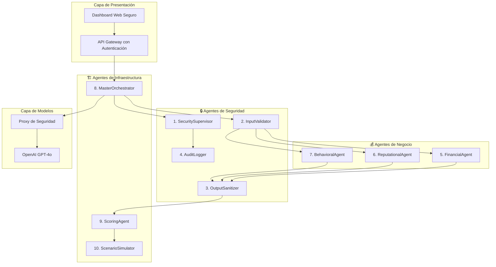

# Documento de Diseño - Sistema de Evaluación Inteligente de Riesgo Financiero para PYMEs

## Visión General

El sistema implementa una arquitectura multiagente segura utilizando LangChain con APIs de OpenAI (para prototipo) para evaluar el riesgo crediticio de PYMEs. La arquitectura sigue los principios del Google SAIF Framework y las mejores prácticas del OWASP Top 10 para LLMs, garantizando seguridad, privacidad y auditabilidad completa.

**Nota de Implementación**: Para el hackathon se utilizará GPT-4o de OpenAI con proxy de seguridad y anonimización de datos. La versión de producción debe migrar a modelos locales para cumplimiento regulatorio completo.

### Principios de Diseño

1. **Seguridad por Diseño**: Todos los componentes implementan controles de seguridad desde su concepción
2. **Proxy de Seguridad**: Anonimización y filtrado de datos antes de envío a APIs externas
3. **Aislamiento de Agentes**: Cada agente opera con permisos limitados y validación de entrada/salida
4. **Trazabilidad Completa**: Registro detallado de todas las operaciones para auditoría
5. **Validación Multicapa**: Múltiples niveles de validación y sanitización de datos

## Arquitectura

### Arquitectura de Alto Nivel



### Sistema de 10 Agentes Especializados

El sistema implementa exactamente 10 agentes especializados distribuidos en 3 categorías principales:

## 🔒 AGENTES DE SEGURIDAD (4 agentes)

#### 1. SecuritySupervisor
- **Responsabilidad**: Monitoreo central y detección de anomalías en tiempo real
- **Tecnología**: OpenAI GPT-4o con prompts de detección de seguridad
- **Funciones**: Supervisión de operaciones, alertas de seguridad, circuit breakers

#### 2. InputValidator  
- **Responsabilidad**: Validación y sanitización de todas las entradas del sistema
- **Tecnología**: OpenAI GPT-4o con prompts anti-prompt injection
- **Funciones**: Detección de prompt injection, sanitización de datos, filtrado de inputs maliciosos

#### 3. OutputSanitizer
- **Responsabilidad**: Validación y filtrado de todas las salidas de los modelos
- **Tecnología**: OpenAI GPT-4o con prompts de validación de outputs
- **Funciones**: Filtrado de información sensible, validación de respuestas, explicabilidad segura

#### 4. AuditLogger
- **Responsabilidad**: Registro completo de todas las operaciones para trazabilidad
- **Tecnología**: Sistema de logging Python con encriptación local
- **Funciones**: Logs estructurados, trazabilidad completa, reportes de auditoría

## 💰 AGENTES DE NEGOCIO (3 agentes)

#### 5. FinancialAgent
- **Responsabilidad**: Análisis completo de estados financieros SCVS
- **Tecnología**: OpenAI GPT-4o con prompts especializados en análisis financiero
- **Funciones**: Procesamiento de balances, cálculo de ratios, análisis de solvencia y liquidez

#### 6. ReputationalAgent
- **Responsabilidad**: Análisis de reputación online y redes sociales
- **Tecnología**: OpenAI GPT-4o con prompts de análisis de sentimientos
- **Funciones**: Web scraping seguro, análisis de sentimientos, scoring de reputación digital

#### 7. BehavioralAgent
- **Responsabilidad**: Evaluación de patrones de comportamiento y referencias comerciales
- **Tecnología**: OpenAI GPT-4o con prompts de análisis comportamental
- **Funciones**: Análisis de referencias, patrones de pago, predicción comportamental

## 🏗️ AGENTES DE INFRAESTRUCTURA (3 agentes)

#### 8. MasterOrchestrator
- **Responsabilidad**: Coordinación central de todo el flujo de evaluación
- **Tecnología**: LangChain + CrewAI para coordinación de agentes
- **Funciones**: Distribución de tareas, coordinación secuencial, manejo de errores

#### 9. ScoringAgent
- **Responsabilidad**: Consolidación final y generación del scoring de riesgo
- **Tecnología**: OpenAI GPT-4o con prompts de consolidación y scoring
- **Funciones**: Consolidación de resultados, scoring 0-1000, explicabilidad del puntaje

#### 10. ScenarioSimulator
- **Responsabilidad**: Simulaciones "qué pasaría si" y análisis de escenarios
- **Tecnología**: OpenAI GPT-4o con prompts de simulación y análisis
- **Funciones**: Simulación de escenarios, recálculo dinámico, comparación de resultados

## Componentes y Interfaces

### 1. Capa de Ingesta de Datos

#### Procesador de Estados Financieros SCVS
```python
class SCVSProcessor:
    def __init__(self):
        self.validator = FinancialDataValidator()
        self.sanitizer = DataSanitizer()
    
    def process_financial_statement(self, file_path: str) -> FinancialData:
        # Validación de formato y estructura
        # Extracción de datos estructurados
        # Sanitización contra inyecciones
        pass
```

#### Web Scraper Seguro
```python
class SecureWebScraper:
    def __init__(self):
        self.rate_limiter = RateLimiter()
        self.content_filter = ContentFilter()
    
    def scrape_social_media(self, url: str) -> SocialMediaData:
        # Scraping con rate limiting
        # Filtrado de contenido malicioso
        # Validación de fuentes
        pass
```

### 2. Capa de Procesamiento de Agentes

#### Interfaz Base de Agente
```python
from abc import ABC, abstractmethod
from typing import Dict, Any

class BaseAgent(ABC):
    def __init__(self, model_path: str, security_context: SecurityContext):
        self.model = self.load_local_model(model_path)
        self.security_context = security_context
        self.validator = InputValidator()
    
    @abstractmethod
    def analyze(self, data: Dict[str, Any]) -> AgentResult:
        pass
    
    def validate_input(self, data: Dict[str, Any]) -> bool:
        # Validación contra prompt injection
        # Sanitización de inputs
        pass
```

#### Coordinador de Agentes
```python
class AgentCoordinator:
    def __init__(self):
        self.agents = self.initialize_agents()
        self.security_supervisor = SecuritySupervisor()
    
    def orchestrate_analysis(self, company_data: CompanyData) -> RiskAssessment:
        # Distribución de tareas a agentes
        # Monitoreo de seguridad en tiempo real
        # Consolidación de resultados
        pass
```

### 3. Capa de Modelos Locales

#### Gestor de Modelos
```python
class LocalModelManager:
    def __init__(self):
        self.models = {}
        self.model_validator = ModelValidator()
    
    def load_model(self, model_name: str, model_path: str):
        # Validación de integridad del modelo
        # Carga en memoria segura
        # Configuración de sandboxing
        pass
```

### 4. Capa de Seguridad

#### Sistema de Detección de Intrusiones
```python
class SecurityMonitor:
    def __init__(self):
        self.anomaly_detector = AnomalyDetector()
        self.prompt_injection_detector = PromptInjectionDetector()
    
    def monitor_operation(self, operation: Operation) -> SecurityStatus:
        # Detección de patrones anómalos
        # Validación de prompts
        # Alertas en tiempo real
        pass
```

## Modelos de Datos

### Estructura de Datos de Entrada

```python
@dataclass
class CompanyData:
    basic_info: CompanyBasicInfo
    financial_statements: FinancialStatements
    social_media_data: SocialMediaData
    commercial_references: List[CommercialReference]
    payment_history: PaymentHistory
    
@dataclass
class FinancialStatements:
    balance_sheet: BalanceSheet
    income_statement: IncomeStatement
    cash_flow: CashFlow
    validation_metadata: ValidationMetadata

@dataclass
class SocialMediaData:
    platform: str
    reputation_score: float
    sentiment_analysis: SentimentAnalysis
    activity_metrics: ActivityMetrics
    content_quality: ContentQuality
```

### Estructura de Resultados

```python
@dataclass
class RiskAssessment:
    company_id: str
    risk_score: float  # 0-1000
    risk_category: RiskCategory  # ALTO, MEDIO, BAJO
    confidence_level: float
    contributing_factors: List[RiskFactor]
    recommended_credit_limit: float
    explanation: ExplanationReport
    audit_trail: AuditTrail

@dataclass
class AgentResult:
    agent_name: str
    analysis_result: Dict[str, Any]
    confidence_score: float
    processing_time: float
    security_status: SecurityStatus
    validation_results: ValidationResults
```

## Manejo de Errores

### Estrategia de Manejo de Errores

1. **Aislamiento de Fallos**: Los errores en un agente no afectan a otros
2. **Degradación Gradual**: El sistema continúa operando con capacidad reducida
3. **Recuperación Automática**: Reinicio automático de agentes fallidos
4. **Alertas Proactivas**: Notificación inmediata de errores críticos

### Tipos de Errores y Respuestas

```python
class ErrorHandler:
    def handle_agent_failure(self, agent_name: str, error: Exception):
        # Aislar agente fallido
        # Continuar con agentes restantes
        # Registrar para auditoría
        pass
    
    def handle_security_breach(self, breach_type: str, context: Dict):
        # Bloquear operación inmediatamente
        # Alertar al equipo de seguridad
        # Registrar incidente
        pass
    
    def handle_data_validation_error(self, data: Any, validation_error: ValidationError):
        # Rechazar datos inválidos
        # Solicitar corrección
        # Registrar intento
        pass
```

## Estrategia de Testing

### Testing de Seguridad

1. **Penetration Testing**: Pruebas regulares de penetración
2. **Adversarial Testing**: Pruebas con inputs maliciosos
3. **Prompt Injection Testing**: Validación contra ataques de inyección
4. **Data Poisoning Testing**: Pruebas con datos contaminados

### Testing Funcional

```python
class SecurityTestSuite:
    def test_prompt_injection_resistance(self):
        # Pruebas con prompts maliciosos
        pass
    
    def test_data_isolation(self):
        # Verificar aislamiento entre empresas
        pass
    
    def test_model_robustness(self):
        # Pruebas adversariales en modelos
        pass
    
    def test_audit_trail_integrity(self):
        # Verificar integridad de logs
        pass
```

### Testing de Rendimiento

1. **Load Testing**: Pruebas con múltiples evaluaciones simultáneas
2. **Stress Testing**: Pruebas bajo condiciones extremas
3. **Memory Leak Testing**: Verificación de gestión de memoria
4. **Latency Testing**: Medición de tiempos de respuesta

## Consideraciones de Implementación

### Tecnologías Principales

- **Framework de Agentes**: LangChain + CrewAI
- **Modelos**: OpenAI GPT-4o (con proxy de seguridad)
- **Base de Datos**: JSON/SQLite para prototipo
- **Backend**: FastAPI con middleware de seguridad
- **Frontend**: Streamlit con autenticación
- **Logging**: Python logging con encriptación local

### Configuración de Seguridad

```yaml
security_config:
  model_isolation: true
  data_encryption: AES-256
  audit_logging: comprehensive
  access_control: RBAC
  network_isolation: true
  input_validation: strict
  output_sanitization: enabled
```

### Métricas de Rendimiento

- **Throughput**: 100+ evaluaciones concurrentes
- **Latencia**: < 5 minutos por evaluación
- **Disponibilidad**: 99.9% uptime
- **Precisión**: > 85% accuracy en scoring
- **Seguridad**: 0 brechas de datos toleradas

Este diseño proporciona una base sólida para implementar un sistema de evaluación de riesgo financiero seguro, escalable y confiable para instituciones financieras.